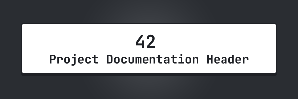
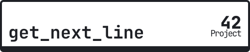
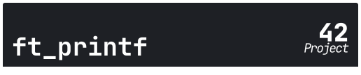
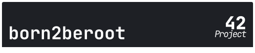
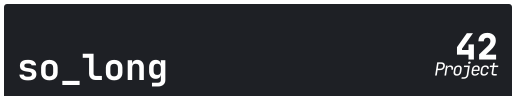
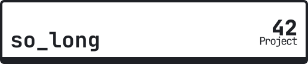
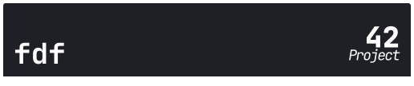

[Leia a versão PT-BR](README_pt-br.md)

## About the 42 PDH 
The 42 PDH (42 Project Documentation Header) is a simple collection of images containing the name of 42 projects to be used as a header in the documentation of 42 projects.

## How to use
It's very simple, just download the image of the project you want to use the header in and add the image to your README.md (with a link).

## Variations
Each header contains a light themed version and a dark themed version, feel free to choose which one you prefer!

## Available headers
Below is a list of all available headers:

Dark | Light
-- | --
 | 
 | 
 | 
 | 
 | 
 | 
 | 
 | 

## Support the project using our badge!
Use our badge in your project, download the image below and add it to your README.md!

## License
The project is under [MIT](https://opensource.org/license/mit) license.
