

## Sobre o 42 PDH 
O 42 PDH (42 Project Documentation Header) é uma simples coleção de imagens contendo o nome dos projetos da 42 para serem usados como cabeçalho na documentação dos projetos da 42.

## Como utilizar?
É bem simples, basta baixar a imagem do projeto em que queira utilizar o header e adicionar a imagem ao seu README.md (com um link).

## Exemplo
Você consegue ver um exemplo aqui no readme da [minha libft](https://github.com/gawbsouza/42-libft) 🤠.

## Variações
Cada header contém uma versão com tema claro e uma versão com tema escuro, fique a vontate para escolher o que preferir!

## Headers disponíveis
Logo abaixo temos uma lista com todos os headers disponíveis:

Dark | Light
-- | --
 | 
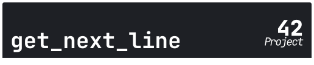 | 
 | 
 | 
 | 
 | 
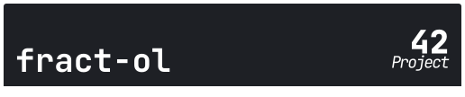 | 
 | 
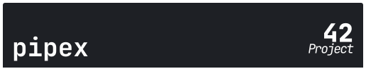 | 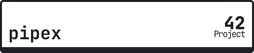
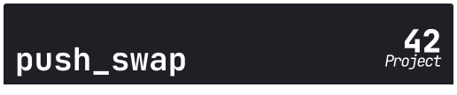 | 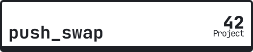
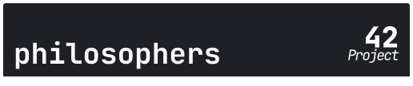 | 
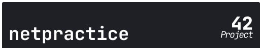 | 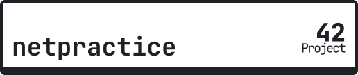
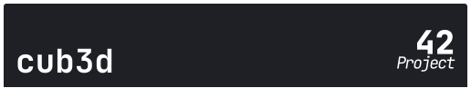 | 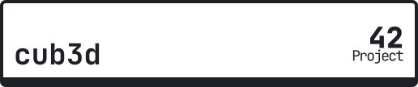
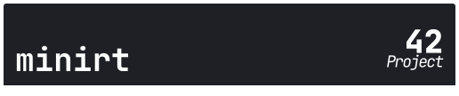 | 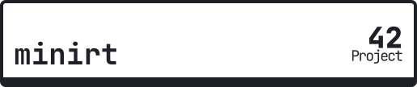
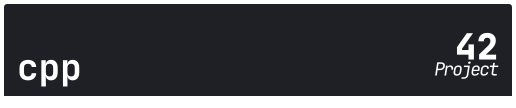 | 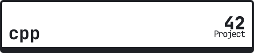
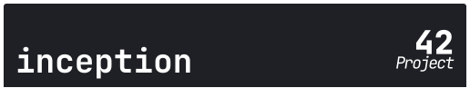 | 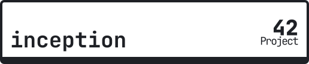
 | 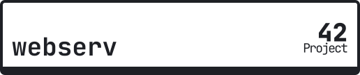
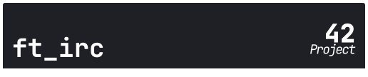 | 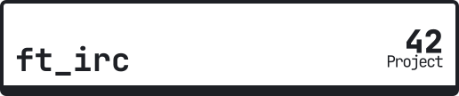
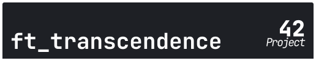 | 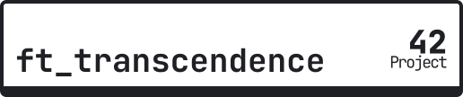

## Apoie o projeto utilizando nossa badge!
Utilize nossa badge em seu projeto, baixe a imagem abaixo e adicione em seu README.md!

## Licença
O projeto está sob a licença [MIT](https://opensource.org/license/mit).
